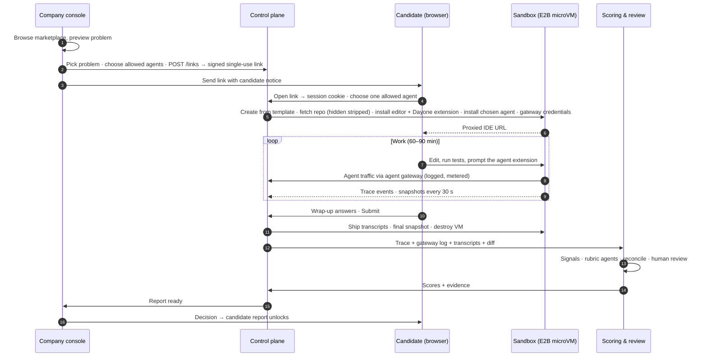
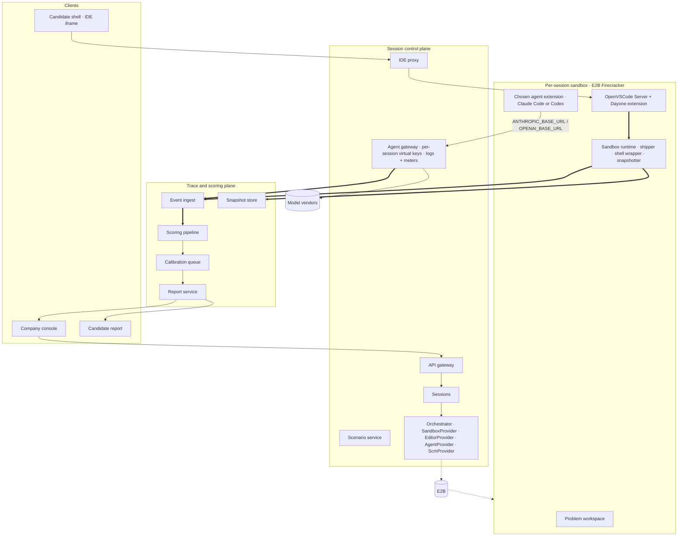

# Architecture

Status: v0.2 · 13 September 2026 · reflects the decisions to use E2B, OpenVSCode Server, and IDE-extension agents (Claude Code, Codex) chosen per session

Rendered diagrams: `diagrams/png/01-end-to-end-flow.png`, `diagrams/png/02-system-architecture.png`. Mermaid sources are at the end of this document.

## The system in one picture

```
Clients (browser)            Company console · Candidate shell · Candidate report
        │
Session control plane        API gateway · Scenario service · Sessions · IDE proxy · Orchestrator · Agent gateway
        │                    (TypeScript, Fastify, Postgres, object storage, queue; one region)
        │
Per-session sandbox          E2B Firecracker microVM · problem repo · OpenVSCode Server · Dayone extension
(rented, destroyed after)    · chosen agent extension (Claude Code or Codex) · shell wrapper · snapshotter
        │
Trace & scoring plane        Event ingest · Snapshot store · Scoring pipeline · Calibration queue · Reports · Monitoring
        │
External                     E2B · model vendors (through our gateway) · container registry · email · ATS (later)
```

Two interfaces keep the big choices reversible: `SandboxProvider` (E2B today) and `AgentProvider` (IDE extensions today, hosted agent later). See `PLUGINS.md`.

## Tiers and components

### Clients

- **Company console**: marketplace of problems, link generation with allowed-agent selection, sessions list, report and replay. Talks only to the API.
- **Candidate shell**: the page the interview link opens. Shows the ticket, guided steps, timer, and the agent choice; embeds the IDE in an iframe on a per-session subdomain; reconnect-safe. In V0 the agent chat itself is the extension's own panel inside VS Code.
- **Candidate report**: post-decision feedback view of the same report service.

### Session control plane (we build)

| Component | Responsibility |
| --- | --- |
| API gateway | Auth for three separate principals: company users (magic link), candidate sessions (signed single-use link → cookie), sandboxes (per-session event token). Rate limits. |
| Scenario service | Reads problem repositories (`PROBLEM-FORMAT.md`), validates them, exposes the marketplace, applies variants, strips hidden content before provisioning. |
| Sessions service | The session state machine (`DOMAIN.md`), heartbeats, expiry, resume, the allowed-agents list and the candidate's choice. |
| Orchestrator | Provisions a sandbox from a problem's template through `SandboxProvider`, fetches the problem repo through `ScmProvider`, installs the editor through `EditorProvider` and the chosen agent through `AgentProvider`, returns URLs. Owns the warm pool later. |
| IDE proxy | Off-the-shelf reverse proxy (Caddy, Traefik or Cloudflare) mapping `<session>.ide.<domain>` to the VM's editor port with the connection token. Not custom code. |
| Agent gateway | An HTTP proxy in front of model vendors. The sandbox is configured so the agent extension talks to the gateway (for Anthropic-compatible clients via `ANTHROPIC_BASE_URL`, for OpenAI-compatible clients via `OPENAI_BASE_URL`) using a per-session virtual key. The gateway injects the real vendor key, logs prompts and completions as trace events, meters tokens and cost, and enforces the session budget. This is the reliable agent trace when the agent is a third-party extension. |

### Per-session sandbox (rented)

One E2B Firecracker microVM per session, 2 vCPU / 4 GB by default, egress allow-list: control plane, agent gateway, optional package registries. Destroyed on submit; trace and snapshots retained.

Inside the VM:

- **Problem workspace**: the problem repository at the pinned ref with variant applied, dependencies installed, services started per `.dayone/setup.sh`. Graded tests live outside the writable tree.
- **OpenVSCode Server** with a connection token; marketplace and settings sync disabled; themed.
- **Dayone extension** (`packages/vscode-extension`): emits document changes, saves, terminal commands via shell integration, and test runs; tags edits with a source heuristic (human typing vs. large programmatic replacements while an agent panel is active).
- **Agent extension**: exactly one of the allowed agents, chosen by the candidate at start, installed by its `AgentProvider`. Configured to use the agent gateway. Its own permission prompts serve as the apply/decline step in V0; where the agent writes transcript files (Claude Code and Codex both do), the runtime ships them at session end.
- **Sandbox runtime** (`packages/sandbox-runtime`): bootstrap (installs the chosen agent, starts the editor, registers with the control plane), event shipper (batches events to ingest), shell wrapper and test shim, snapshotter (`git commit` to a hidden branch every 30 s and on save bursts), telemetry.

### Trace and scoring plane (we build)

| Component | Responsibility |
| --- | --- |
| Event ingest | Validates the sandbox token and every event against the schema (`EVENTS.md`); append-only store in Postgres with large payloads in object storage. Treats everything from a sandbox as untrusted input. |
| Snapshot store | Repo snapshots, final diff, written answers. |
| Scoring pipeline | Normaliser → deterministic process signals → rubric agents (5 runs per item, evidence citations) → reconciler → report composer. `SCORING.md`. |
| Calibration queue | Human review UI on top of replay; every session in V0 until agreement is proven. |
| Report service | Engineering Score, key moments, replay, debrief questions; company view first, candidate view after the decision. |
| Monitoring | Score drift, leakage signals, integrity flags, fairness screens. Flags route to humans, never to scores. |

## Session lifecycle (V0)

```
company: pick problem → choose allowed agents → generate link         Session: created
candidate: open link → session cookie → choose one agent               → agent_selected
orchestrator: create sandbox from template → fetch repo (hidden stripped)
              → install editor + Dayone extension → install chosen agent
              → configure gateway credentials → start editor → URLs     → provisioning → live
candidate works; events stream; heartbeats; pause after idle           → live ⇄ paused
candidate submits wrap-up answers                                       → submitted
final snapshot, transcripts shipped, VM destroyed                       → (sandbox gone)
grading job; human review                                               → grading → graded
report composed; company notified; candidate report after decision      → reported
timeouts / failures                                                     → expired | failed
```

Details and invariants of each state are in `DOMAIN.md`.

## How agents run, and what we capture

V0 uses **IDE-extension agents**: the Claude Code and Codex VS Code extensions running inside OpenVSCode Server. The company selects which agents are allowed when generating the link; the candidate selects one when starting. The `AgentProvider` for each knows how to install the extension in the sandbox, how to point it at the agent gateway, which transcript files it writes, and what it can and cannot report.

Capture with extension agents has four sources, in order of reliability:

1. **Agent gateway logs**: every prompt and completion, token counts, cost, timing. Vendor-neutral and complete for model traffic.
2. **Dayone extension events**: file changes with a source heuristic, saves, terminal commands, test results.
3. **Agent transcript files** shipped at session end: tool calls, accepted and rejected proposals where the agent records them.
4. **Snapshotter**: the working tree every 30 seconds, the backstop for attribution.

Known trade-off, recorded in `DECISIONS.md`: with extension agents the apply/decline step is the extension's own UI, so accept and reject events come from transcripts rather than from a gate we control. The `AgentProvider` interface also supports `kind: "hosted"` for a future agent host we run ourselves (for example on the Claude Agent SDK), which would give a first-class gate and deterministic planted suggestions.

## Security model

- **Three principals** at the gateway, never interchangeable: company user, candidate session, sandbox.
- **No vendor keys in the VM.** The sandbox holds a per-session gateway token and a per-session ingest token, both revoked at session end.
- **VM-level isolation** for every candidate session (Firecracker). Never shared-kernel containers.
- **Egress allow-list** per sandbox. The gateway is the only path to model vendors.
- **Hidden problem content** (`.dayone/hidden/`) is stripped before the repo enters a sandbox and never leaves the scenario service except to the grader.
- **Events are data, not logs.** Stored separately from application logs, with retention and deletion per session.

## Deployment shape (V0)

One region. `apps/api` and `apps/worker` as two Node processes (containers) behind the IDE proxy and an ordinary HTTPS load balancer; Postgres; S3-compatible object storage; Redis-backed queue. Sandboxes on E2B. Model traffic via the agent gateway (part of `apps/api` in V0, its own process later).

## Non-goals for V0

Debug and Review modes, repo forking onto customer code, variant generation, warm pools beyond two VMs, ATS integrations, SSO, self-hosted sandboxes, a hosted agent, percentiles and bands, split sittings, dispute UI, PDF export, candidate practice tier.

## Mermaid sources

### End-to-end flow



### System architecture


